<p align="center">
  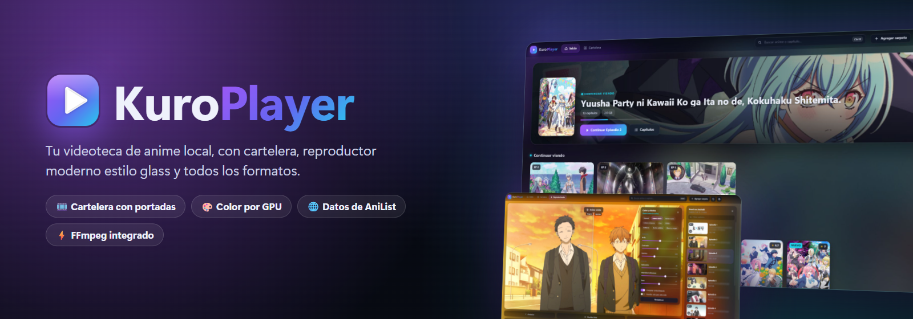
</p>

<p align="center">
  <b>Tu videoteca local de anime, películas y series</b>: cartelera con portadas, reproductor moderno estilo <i>glass</i>, color y mejora de imagen por GPU y soporte para prácticamente cualquier formato de video.
</p>

<p align="center">
  
  
  
  
  
  
</p>

<p align="center">
  <a href="https://ko-fi.com/gls726"></a>
</p>

---

## ✨ ¿Qué es?

**Kuro Player** convierte tus carpetas de anime (y de películas o series) en una cartelera como la de un servicio de streaming, pero **100 % local**: sin cuentas, sin anuncios y sin subir nada a internet. Cada subcarpeta es una serie y sus videos son los capítulos. Lo abres, eliges y sigues viendo justo donde lo dejaste.


## 📥 Descargar

1. Ve a **[Releases](../../releases/latest)** y descarga `KuroPlayer-Setup-x.x.x.exe`.
2. Ejecútalo y sigue el instalador (puedes elegir la carpeta de instalación).
3. Abre **Kuro Player**, pulsa **Agregar carpeta** y elige la carpeta donde guardas tu anime.

> Windows puede mostrar el aviso *«Windows protegió su PC»* porque el instalador no tiene firma de pago. Pulsa **Más información → Ejecutar de todas formas**.

## 🖼️ Capturas

| Inicio | Cartelera |
|:---:|:---:|
| 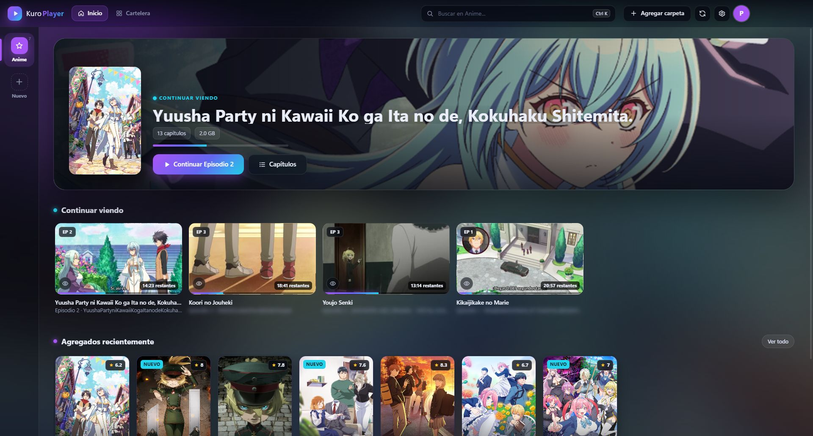 | 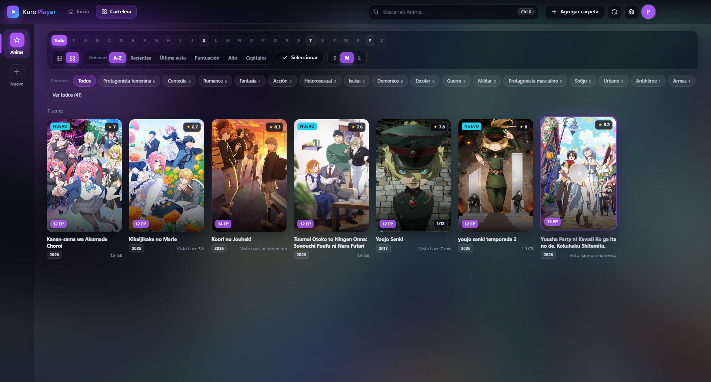 |
| **Vista de lista con detalles** | **Página de la serie** |
| 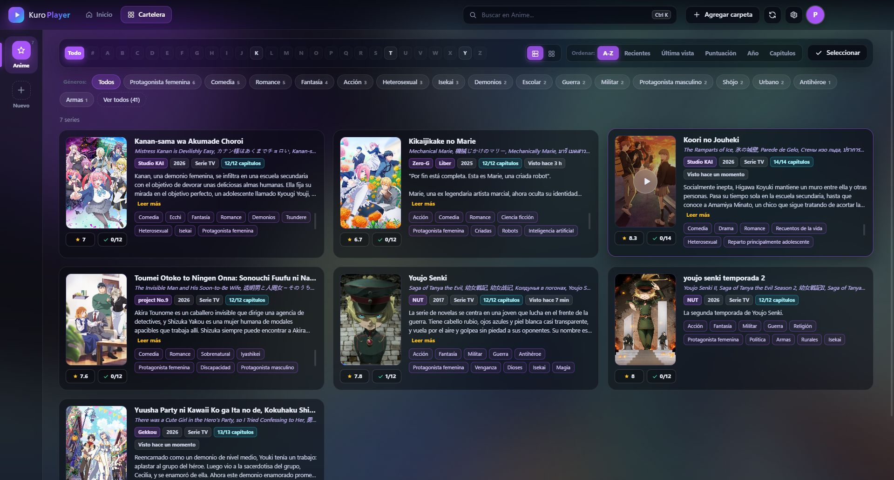 | 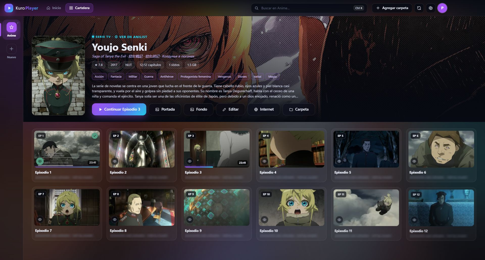 |
| **Reproductor con lista de capítulos** | **Color y efectos (antes / después)** |
| 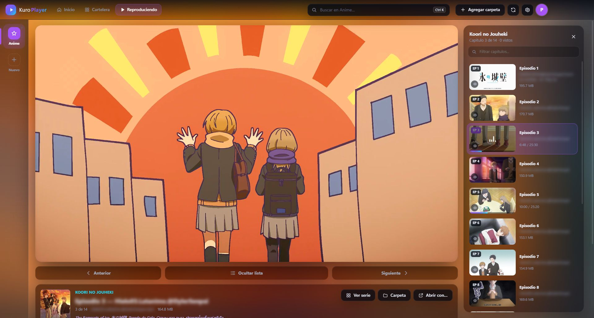 | 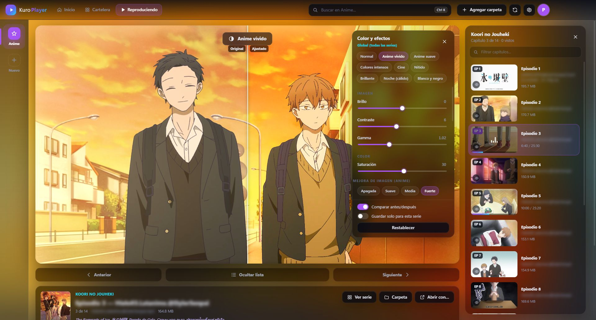 |
| **Modo cine** | **¿Continuar o empezar de cero?** |
| 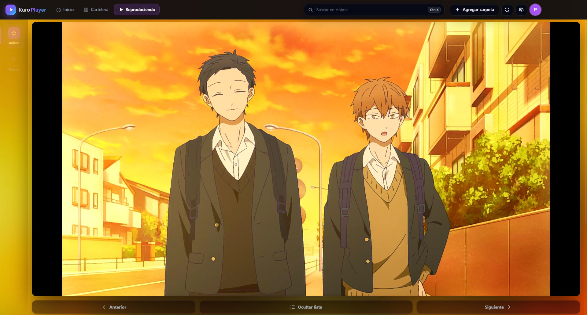 | 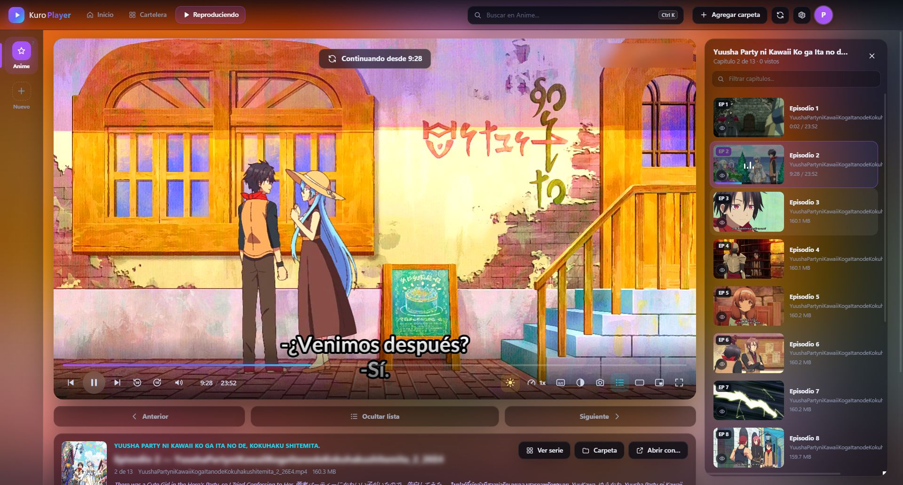 |
| **Filtro por género** | **Acerca de** |
| 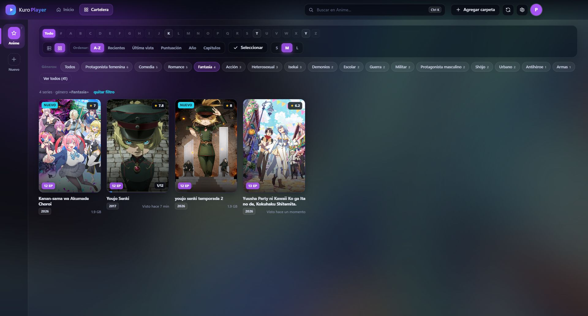 | 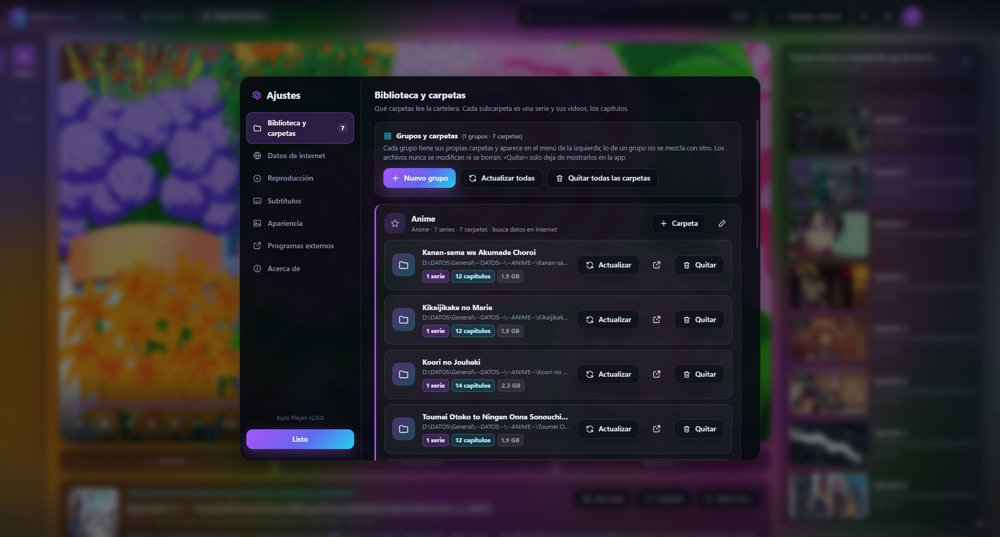 |
| **Grupos y carpetas** | **Tema claro** |
| 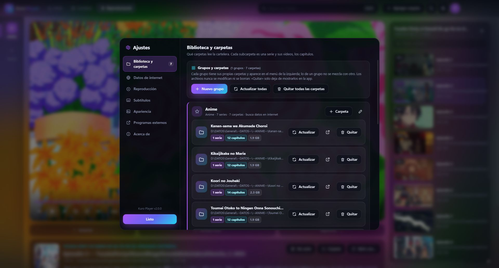 | 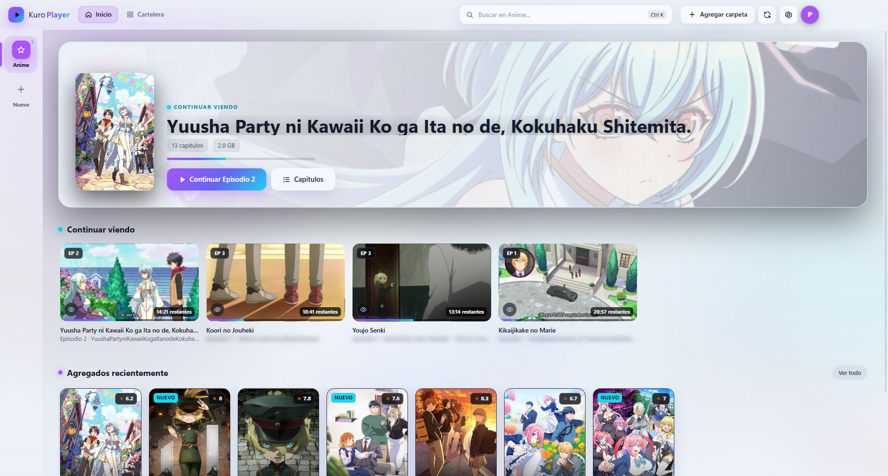 |
| **Interfaz en inglés** | **Apariencia** |
| 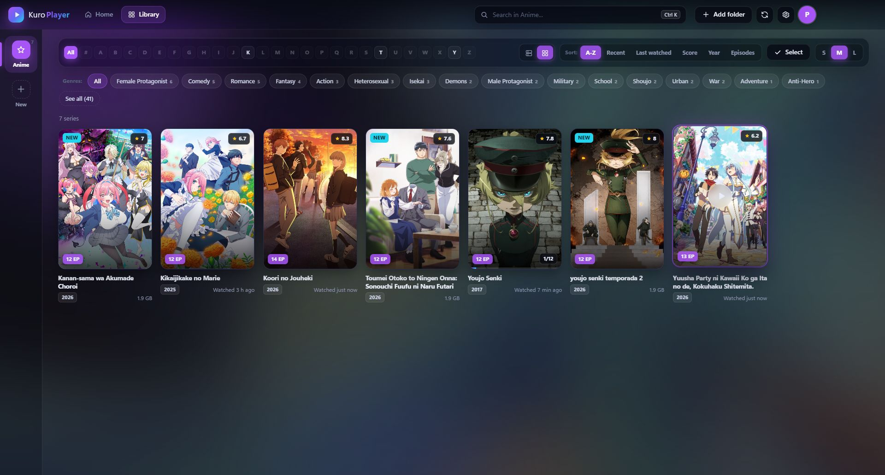 | 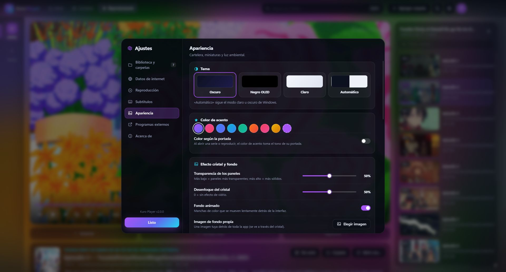 |

## 🆕 Novedades de la 2.0

- **Grupos** en un menú lateral: Anime, Películas, Series u Otros, cada uno con sus propias carpetas, ícono y color. Lo de un grupo no se mezcla con otro, y cada grupo decide si busca datos en internet.
- **Más fuentes**: TVmaze y Wikipedia para series y películas, además de AniList, MyAnimeList y Kitsu. Si algo no se reconoce, pega el enlace de su página y queda vinculado.
- **Temas**: oscuro, claro, negro OLED o automático; color de acento (o el de la portada); transparencia y desenfoque del cristal; imagen de fondo propia; tamaño de la interfaz y **modo rendimiento**.
- **Saltar opening y ending** con las marcas de [AniSkip](https://aniskip.com) o las tuyas.
- **Mejora de imagen para anime** (inspirada en Anime4K): escala el video a la resolución de tu pantalla y afina las líneas en la GPU.
- **Perfiles** con su propio progreso, **copia de seguridad** de toda la biblioteca y **aviso de actualizaciones** desde la app.
- Saltos más rápidos al abrir un video en modo compatible, precarga del siguiente capítulo y panel de **diagnóstico** (`Shift` + `D`).
- **Interfaz en inglés** (Ajustes → Apariencia → Idioma).
- **Favoritos ♥** (2.1): marca series, películas o videos y míralos en su propia sección del Inicio; los videos favoritos se reproducen como una lista propia, y cada carpeta tiene su filtro de favoritos.
- **Filtro por duración** en los grupos «Otros» (2.1): menos de 1 minuto, 1–5, 5–10, 10–30 o más de 30 minutos, en la cartelera y dentro de cada carpeta; cada video muestra su duración.
- **Kuro, el oso** (2.1.2): en la esquina del menú de grupos; un haz de luz recorre su contorno mientras la app está procesando algo.
- **Liviano en gráficas integradas** (2.0.1): el ajuste «Uso de la tarjeta gráfica» detecta tu equipo y elige entre Calidad máxima, Equilibrado o Ahorro.

## 🚀 Características

### 🗂️ Grupos
- Crea los grupos que quieras desde el botón **Nuevo** del menú lateral. Clic derecho sobre un grupo para editarlo, reordenarlo o cargar sus datos de internet.
- En los grupos de **Películas** cada video suelto es una película con su propia tarjeta.

### 🎞️ Cartelera
- Cada subcarpeta se convierte en una tarjeta con portada. Usa `cover.jpg`, `poster.jpg` o `portada.jpg` de la carpeta, la portada de internet o un cuadro del capítulo 1.
- Vista **cuadrícula** o **lista con detalles**, tres tamaños, filtro por letra, orden por nombre, recientes, última vista, puntuación, año o capítulos.
- **Filtro por género** y **categorías propias**: selecciona varias series y agrúpalas.
- **Temporadas en subcarpetas**: agrúpalas en una serie con pestañas o sepáralas en tarjetas, serie por serie.
- Detecta solo las **series y capítulos nuevos** que copies (marca «NUEVO» durante 7 días), sin volver a cargar todo.

### 🌐 Datos de internet
- Busca cada serie en **AniList** (con Kitsu y MyAnimeList como respaldo) y trae sinopsis en español, géneros, estudio, año, puntuación, portada y fondo. Las series de TV usan **TVmaze** y las películas **Wikipedia**; ninguna fuente pide cuenta ni clave.
- ¿No la encuentra? **Pega el enlace** de AniList, MyAnimeList, Kitsu, TVmaze o Wikipedia.
- Entiende nombres **pegados**, con **guiones bajos**, **prefijos de orden** (`1_`, `M_`), incompletos o con errores de escritura.
- Sugiere **renombrar la carpeta** con el título oficial conservando tus prefijos. También puedes decirle «mantener mi nombre».

### ▶️ Reproductor
- **Continúa donde lo dejaste**: pregunta si seguir o empezar de cero y, si no eliges, continúa solo a los 5 segundos.
- Lista de capítulos lateral plegable, capítulo siguiente automático con cuenta atrás y ojo para marcar como visto.
- **Color por GPU (WebGL)**: brillo, contraste, gamma, saturación, *vibrance*, tono, temperatura, nitidez y viñeta, con preajustes («Anime vívido», «Cine», «Noche»…) y **comparación antes/después**. Global o por serie.
- **Mejora de imagen** (suave, media o fuerte): escalado a la resolución de pantalla y líneas nítidas, ideal para capítulos de 480p o 720p.
- **Saltar opening / ending** con un botón o automáticamente.
- **Modo cine** y **luz ambiental** alrededor del video con intensidad regulable.
- Subtítulos `.srt`, `.ass` y `.vtt` externos o incrustados, varias pistas de audio (anime dual), velocidad, cuadro a cuadro, capturas y **mini reproductor**.
- **Abrir con…** PotPlayer, VLC, MPC-HC, mpv y otros reproductores instalados, continuando en el mismo segundo.

### ⚡ Todos los formatos
- Reproduce directo lo que Chromium soporta (MP4, MKV, WebM, H.264, HEVC por hardware, VP9, AV1…).
- Lo demás (AVI, WMV, FLV, RMVB, Hi10P, AC3, DTS, Xvid/DivX…) se convierte **al vuelo con FFmpeg** usando la GPU (NVENC, Quick Sync o AMF) sin archivos temporales.

### 🏠 Inicio
- «Continuar viendo», **recomendación del día** (5 capítulos al azar), botón **«Elegir uno al azar»**, capítulos nuevos y series agregadas recientemente. Cada sección se puede activar o desactivar.

## ⌨️ Atajos de teclado

| Tecla | Acción | Tecla | Acción |
|---|---|---|---|
| `Espacio` / `K` | Reproducir / pausa | `F` / `Enter` | Pantalla completa |
| `←` `→` | ±5 s (configurable) | `Shift` + `←` `→` | ±30 s |
| `↑` `↓` | Volumen | `M` | Silencio |
| `N` / `P` | Capítulo siguiente / anterior | `L` | Mostrar / ocultar lista |
| `C` | Panel de color | `S` | Cambiar subtítulos |
| `T` | Modo cine | `G` | Luz ambiental |
| `[` `]` | Velocidad | `=` | Velocidad normal |
| `,` `.` | Cuadro a cuadro | `0`–`9` | Saltar al 0–90 % |
| `Inicio` / `Fin` | Principio / final | `Ctrl` + `S` | Captura de pantalla |
| `I` | Mini reproductor | `Ctrl` + `K` | Buscar |
| `Shift` + `E` | Mejora de imagen | `Shift` + `D` | Diagnóstico |

## 📁 Cómo organizar tu anime

```
Anime/                         ← la carpeta que agregas
├── Sousou no Frieren/         ← una serie
│   ├── cover.jpg              ← (opcional) portada
│   ├── fondo.jpg              ← (opcional) fondo / banner
│   ├── Frieren - 01.mkv
│   ├── Frieren - 01.ass       ← subtítulo con el mismo nombre
│   └── Frieren - 02.mkv
└── Youjo Senki/
    ├── Temporada 1/           ← temporadas en subcarpetas
    └── Temporada 2/
```

El número de capítulo se detecta en nombres como `Serie - 05`, `S01E05`, `1x05`, `Ep 5`, `Capitulo 5`, `Serie_05` o `Hielo05`.

## 🛠️ Compilar desde el código

Requisitos: [Node.js](https://nodejs.org) 20 o superior.

```bash
npm install
npm start               # abrir en modo desarrollo
npm run build           # versión portátil en dist/win-unpacked
npm run build:setup     # instalador dist/KuroPlayer-Setup-x.x.x.exe
```

## 🔒 Tus datos

- Todo se guarda en tu equipo, en `%APPDATA%\Kuro Player` (biblioteca, progreso, portadas y ajustes).
- **Tus videos nunca se modifican ni se borran.** Solo cambia el nombre de una carpeta si tú aceptas la sugerencia.
- Solo se conecta a internet para buscar datos de las series (AniList, Kitsu, Jikan, TVmaze, Wikipedia), las marcas de opening/ending (AniSkip), traducir sinopsis y revisar si hay una versión nueva en GitHub. Cada grupo puede tener la búsqueda en internet apagada.
- **Copia de seguridad** en **Ajustes → Reproducción**: un solo archivo `.kuroplayer` con todo.
- En **Ajustes → Biblioteca → Restablecer Kuro Player** puedes dejarlo como recién instalado.

## 🧩 Hecho con

[Electron](https://www.electronjs.org) · [FFmpeg](https://ffmpeg.org) ([ffmpeg-static](https://github.com/eugeneware/ffmpeg-static)) · [AniList](https://anilist.co) · [Kitsu](https://kitsu.app) · [Jikan / MyAnimeList](https://jikan.moe) · [TVmaze](https://www.tvmaze.com/api) · [Wikipedia](https://www.wikipedia.org) · [AniSkip](https://aniskip.com) · [Anime4K](https://github.com/bloc97/Anime4K) (idea de la mejora de imagen, MIT)

## ☕ Apoyar el proyecto

Kuro Player es gratis, sin anuncios y sin cuentas. Si te gusta y quieres apoyar su desarrollo, puedes **[invitarme un café en Ko-fi](https://ko-fi.com/gls726)** 💜. También ayuda mucho dejar una ⭐ en el repositorio o reportar errores en *Issues*.

## 📄 Licencia

El código de Kuro Player se publica bajo la [licencia MIT](LICENSE).

El instalador incluye **FFmpeg** y **FFprobe** (de [ffmpeg-static](https://github.com/eugeneware/ffmpeg-static) y [ffprobe-static](https://github.com/joshwnj/ffprobe-static)), que se distribuyen con su propia licencia (GPL). Su código fuente está disponible en [ffmpeg.org](https://ffmpeg.org/download.html). Kuro Player no incluye ni distribuye ningún video: solo reproduce los archivos que tú tengas.

---

<p align="center">Hecho con 💜 para ver anime como se merece.</p>
